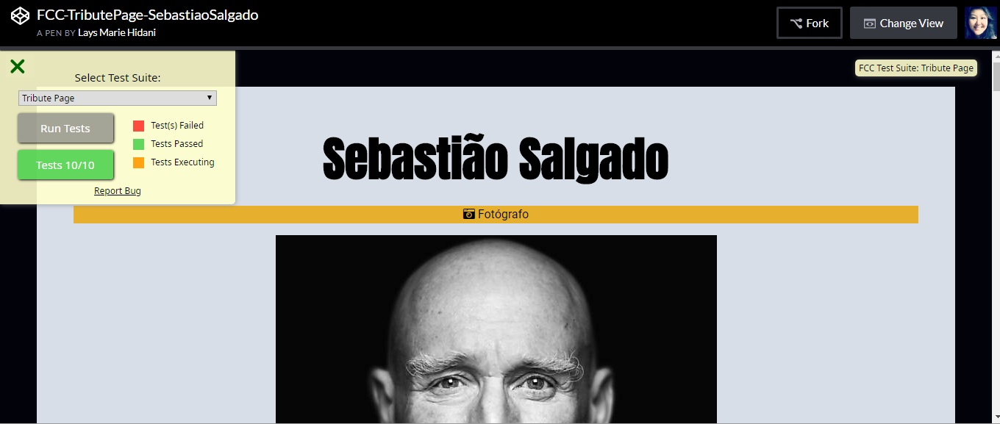
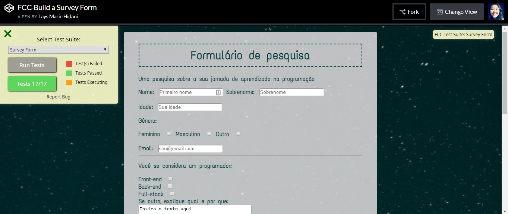

# #100DaysOfCode Log - Round 1 - [Lays]

__[Twitter](https://twitter.com/hlays_)__

The log of my #100DaysOfCode challenge. 

:calendar: Started on [November 19, Monday, 2018].

# Log

### :calendar: R1D1
**Today's Progress:** I started my first @freeCodeCamp (Tribute Page) project.

**Thoughts:** I need to check CSS flexbox and grid.

**Link to work:** [FreeCodeCamp - Tribute page](https://codepen.io/hlays/full/OaxNvj)

### R1D2
**Today's Progress:** Working on @freeCodeCamp's Tribute Page.

I reviewed flexbox and grid CSS.

**Thoughts:** Summary and very nice content about flexbox and grid: 
- [Grid](http://grid.malven.co/)
- [flexbox](http://flexbox.malven.co/)

**Link to work:** [FreeCodeCamp - Tribute page](https://codepen.io/hlays/full/OaxNvj)

### :calendar: R1D3
**Today's Progress:** Studying a bit of css and JavaScript. (articles, youtube, book "Javascript - The Definitive Guide").

**Thoughts:** I'm having a bit of trouble with the photo gallery session on my Tribute Page. Reviewing and researching good CSS materials.

**Link to work:** [FreeCodeCamp - Tribute page](https://codepen.io/hlays/full/OaxNvj)

### :calendar: R1D4
**Today's Progress:** Studying a bit of css and JavaScript. (articles, youtube, book "The Definitive Guide Javascript").

**Thoughts:** Javascript - The Definitive Guide by David Flanagan is a excellent book.

**Resorces** Found 3 fun ways to learn more about CSS:

- [Flexbox Froggy](https://flexboxfroggy.com/)
- [CSS Grid Garden](https://cssgridgarden.com/)
- [CSS Dinner](http://flukeout.github.io/)

**Link to work:** [FreeCodeCamp - Tribute page](https://codepen.io/hlays/full/OaxNvj)

### :calendar: R1D5
**Today's Progress:** Studying CSS through the course of [Coding Artist](https://t.co/u9UAbEXmZR).

**Thoughts:** I started the course of [Coding Artist](https://t.co/u9UAbEXmZR). Relly good and recommended.

**Link to work:** [Koala vs1](https://codepen.io/hlays/full/jQxrBB)|[Koala vs2](https://codepen.io/hlays/full/xQjzwE)

### :calendar: R1D6
**Today's Progress:** Progressing in CSS study through the @codingartist_io course.
I finished and submitted @freeCodeCamp's Tribute Page and Survey Form.
Developing a Learning Tracking on Github

**Thoughts:** The Survey Form project was a bit easier for me than the Tribute Page.
I had a little struggle to center the form on the page. And finally I remembered the "margin: self" ... it seems very simple and easy now.

The My Tribute Page photo gallery is working responsibly, but it still does not look as good as I wanted it to.

I have to review and learn a lot more about CSS.

**Link to work:** [FreeCodeCamp - Survey form](https://codepen.io/hlays/full/oQdYEE)

### :calendar: R1D7
**Today's Progress:** I've revised some CSS and started with a Javascript Udemy ([JavaScript - Curso Completo com 6 Projetos Reais](https://www.udemy.com/javascript-curso-completo/)).

**Thoughts:** 

**Link to work:** [FreeCodeCamp - Survey form](https://codepen.io/hlays/full/oQdYEE)

### :calendar: R1D8
** Today's Progress: ** Studing JavaScript Udemy ([JavaScript - Curso Completo com 6 Projetos Reais](https://www.udemy.com/javascript-curso-completo/)).

** Thoughts: ** I wish there were more lists of javascript exercises on the internet to practice and retain knowledge, as is the case with Python. I think I'll use the python exercise lists for JS practice.

**Link to work:** 

### :calendar: R1D9
** Today's Progress: ** Studying basic JavaScript (udemy) and improving CSS.

** Thoughts: ** I do not have much time to study today, but I completed my first hour.

**Link to work:** 

### :calendar: R1D10
** Today's Progress: ** Studying CSS: combinator and pseudo (class and element) selectors. 
I'm also working on a notebook with notes on my CSS learning.

**Link to work:** [My Learning notebooks](https://github.com/hlays/mylearningnotebooks)

### :calendar: R1D11
** Today's Progress: ** I started working on the FreeCodeCamp technical documentation page.

** Thoughts: ** I chose CSS as the theme. Its is a theme that I have had to revise a few times ... 
About me and CSS: Someday, maybe, we'll understand each other. 
We are strengthening our friendship. 😅😆

**Link to work:** [FCC - Technical Documentation Page](https://codepen.io/hlays/full/qQQePp)

### :calendar: R1D12
** Today's Progress: ** Working on the FreeCodeCamp technical documentation page.

** Thoughts: ** Today I've learned new things on HTML, like I've to use plain text to show HTML code into a HTML page (This is a good tool to this convertion http://nosetup.org/php_on_line/convertir_html_texto).

**Link to work:** [FCC - Technical Documentation Page](https://codepen.io/hlays/full/qQQePp)

### :calendar: R1D13
** Today's Progress: ** Today I tried to make my FCC project look a little better. I reviewed about CSS: text-decoration, CSS selectors tips, text-indent, box-shadow, line-height, list-style-type.

** Thoughts: ** Google, W3Schools and MDN are always my best friends.

**Link to work:** [FCC - Technical Documentation Page](https://codepen.io/hlays/full/qQQePp)

### :calendar: R1D14
** Today's Progress: ** Review box model, float, horizontal and vertical navs.

### :calendar: R1D15
** Today's Progress: ** Working on FCC Technical Documentation Page.

** Thoughts: **

**Link to work:** [FCC - Technical Documentation Page](https://codepen.io/hlays/full/qQQePp)

### :calendar: R1D16
** Today's Progress: ** I have completed the FCC Technical Documentation page.

** Thoughts: ** In this project I've struggled a little harder to pass the FCC test. It's because there was a typo in a href link in navbar and it took me a long time to find it. I broke my head, but after resolving it, it all seemed like a silly fail. I will add more content to this page in the future.

**Link to work:** [FCC - Technical Documentation Page](https://codepen.io/hlays/full/qQQePp)

### :calendar: R1D17
** Today's Progress: ** I'm working on the FCC landing page.

** Thoughts: ** I'm having difficulty because my navbar (using display flexbox) is not working well with "fixed position".

**Link to work:** [FCC - Landing Page](https://codepen.io/hlays/full/LXKGYq)

### :calendar: R1D18
** Today's Progress: ** I'm working in #freeCodeCamp Landing page project.

** Thoughts: ** Fixed my navbar. Now, I have to fix some test issues.

**Link to work:** [FCC - Landing Page](https://codepen.io/hlays/full/LXKGYq)

### :calendar: R1D19
** Today's Progress: ** 
- Javascript tutorials and exercises. 
- CSS Dinner
- CSS grid Garden 

### :calendar: R1D20
** Today's Progress: ** 
- Javascript tutorials and exercises. 
- CSS Dinner
- CSS grid Garden 

### :calendar: R1D21
** Today's Progress: **  JS functions

** Thoughts: ** to know a little of python help me a lot to learn javascript

### :calendar: R1D22
** Today's Progress: **  Reviewing HTML, CSS and JS.

### :calendar: R1D23
** Today's Progress: **  Working on a Trivia project with HTML, CSS and JavaScript.

### :calendar: R1D24
** Today's Progress: **  Trivia Project - Laboratoria (pre admission) concluded.

** Thoughts: ** It was difficult to finish this project on time, but the task was completed successfully!

### :calendar: R1D25 #100DaysOfCode

** Today's Progress: ** Code review with my Laboratoria squad, quiz, JavaScript list of exercises.

** Thoughts: ** I enjoyed doing this code review, it's amazing how each person finds a different solution to the same problem. It's cool.

### :calendar: R1D26

** Today's Progress: ** More JS and exercises.

### :calendar: R1D27 
(I paused for this weekend because of appointments. But I read articles and I listened to podcasts in free time.)

** Today's Progress: ** Working on the tests of FCC Product Landing Page and watching JS tutorials.

### :calendar: R1D28 #100DaysOfCode
** Today's Progress: ** I'm working on the FCC landing page. I decided to start with another one. 

I reviewed the fundamentals of JS.

** Thoughts: ** I've to make a navigation menu fixed at the top. As much as I like this set menu on the left side of the page ...

**Link to work:** [FCC - Landing Page](https://codepen.io/hlays/full/LXKGYq)

### :calendar: R1D29 #100DaysOfCode
** Today's Progress: ** 

- I made the horizontal navigation bar fixed in the FCC Product Landing Page project.
- Work on JS FreeCodingCamp lessons and watch tutorials on JS arrays.

** Thoughts: ** I have only one problem to solve in this project to pass the FCC test. The page was very simple, but I liked the result.

**Link to work:** [FCC - Landing Page](https://codepen.io/hlays/full/LXKGYq)

### :calendar: R1D30 #100DaysOfCode
** Today's Progress: ** 

- FCC Product Landing Page Complete! I am now working on FCC Personal Portifolio (which will have more projects :) thanks @freecodecamp for this content building curriculum and experience gained during the projects).
- I worked on the FCC JS curriculum exercises today. I also did some other JS exercises on arrays and functions and watched JS tutorials.

** Thoughts: ** Day 30! A Challenge Month #100DaysOfCode.

**Link to work:** [FCC - Landing Page](https://codepen.io/hlays/full/LXKGYq)

### :calendar: R1D31 #100DaysOfCode
** Today's Progress: ** 

- I started working at FCC Personal Portifolio,
- JS exercises on switch and functions,
- FCC Javascript exercises.

** Thoughts: ** 

### :calendar: R1D32 #100DaysOfCode
** Today's Progress: ** 

- JS exercises and Tutorials,
- FCC Javascript exercises.

** Thoughts: ** 

### :calendar: R1D33 #100DaysOfCode
** Today's Progress: ** 

- JS arrays,
- JS wrapper objects,
- @freecodecamp Javascript exercises.

** Thoughts: **  It's fun work with arrays.

### :calendar: R1D34 #100DaysOfCode
** Today's Progress: ** 

- Working on FCC Personal Portifolio (There is still much to improve, but it is going!)
- Watched JS Tutorials

** Thoughts: **  Today is Christmas Eve, but code challenge is completed!

**Link to work:** [FCC - Personal Portifolio](https://repl.it/@hlays/FCC-Personal-Portifolio)