# #100DaysOfCode Log - Round 1 - [Lays]

__[Twitter](https://twitter.com/search?l=&q=%23100daysofcode%20from%3Ahlays_)__

The log of my #100DaysOfCode challenge. 

:calendar: Started on [November 19, Monday, 2018].

# Log

### :calendar: R1D1
**Today's Progress:** I started my first @freeCodeCamp (Tribute Page) project.

**Thoughts:** I need to check CSS flexbox and grid.

**Link to work:** [FreeCodeCamp - Tribute page](https://codepen.io/hlays/full/OaxNvj)

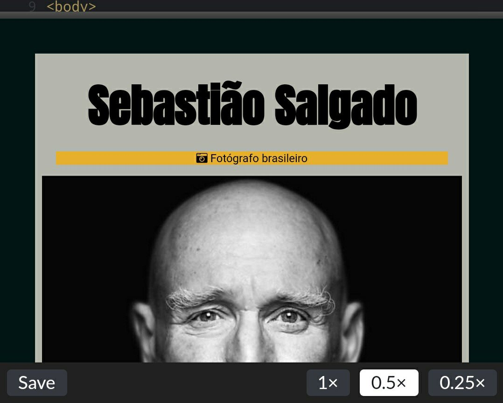

---
### R1D2
**Today's Progress:** Working on @freeCodeCamp's Tribute Page.

I reviewed flexbox and grid CSS.

**Thoughts:** Summary and very nice content about flexbox and grid: 
- [Grid](http://grid.malven.co/)
- [flexbox](http://flexbox.malven.co/)

**Link to work:** [FreeCodeCamp - Tribute page](https://codepen.io/hlays/full/OaxNvj)

---

### :calendar: R1D3
**Today's Progress:** Studying a bit of css and JavaScript. (articles, youtube, book "Javascript - The Definitive Guide").

**Thoughts:** I'm having a bit of trouble with the photo gallery session on my Tribute Page. Reviewing and researching good CSS materials.

**Link to work:** [FreeCodeCamp - Tribute page](https://codepen.io/hlays/full/OaxNvj)

---

### :calendar: R1D4
**Today's Progress:** Studying a bit of css and JavaScript. (articles, youtube, book "The Definitive Guide Javascript").

**Thoughts:** Javascript - The Definitive Guide by David Flanagan is a excellent book.

**Resorces** Found 3 fun ways to learn more about CSS:

- [Flexbox Froggy](https://flexboxfroggy.com/)
- [CSS Grid Garden](https://cssgridgarden.com/)
- [CSS Dinner](http://flukeout.github.io/)

**Link to work:** [FreeCodeCamp - Tribute page](https://codepen.io/hlays/full/OaxNvj)

---

### :calendar: R1D5
**Today's Progress:** Studying CSS through the course of [Coding Artist](https://t.co/u9UAbEXmZR).

**Thoughts:** I started the course of [Coding Artist](https://t.co/u9UAbEXmZR). Relly good and recommended.

**Link to work:** [Koala vs1](https://codepen.io/hlays/full/jQxrBB)|[Koala vs2](https://codepen.io/hlays/full/xQjzwE)

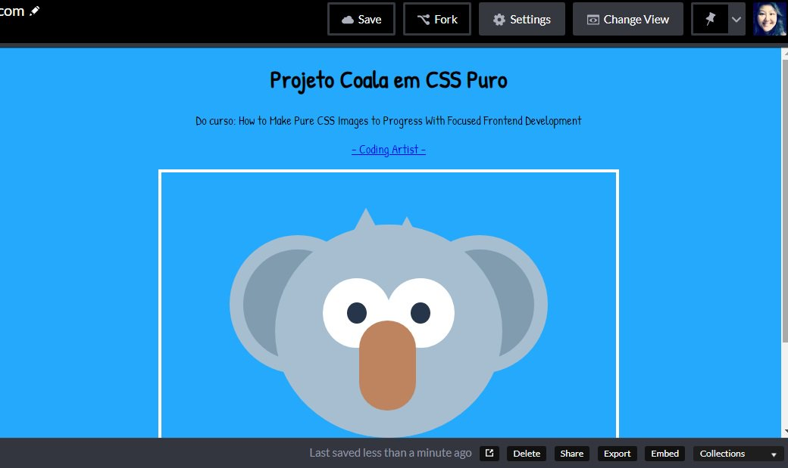

---

### :calendar: R1D6
**Today's Progress:** Progressing in CSS study through the @codingartist_io course.
I finished and submitted @freeCodeCamp's Tribute Page and Survey Form.
Developing a Learning Tracking on Github

**Thoughts:** The Survey Form project was a bit easier for me than the Tribute Page.
I had a little struggle to center the form on the page. And finally I remembered the "margin: self" ... it seems very simple and easy now.

The My Tribute Page photo gallery is working responsibly, but it still does not look as good as I wanted it to.

I have to review and learn a lot more about CSS.

**Link to work:** [FreeCodeCamp - Survey form](https://codepen.io/hlays/full/oQdYEE)

---

### :calendar: R1D7
**Today's Progress:** I've revised some CSS and started with a Javascript Udemy ([JavaScript - Curso Completo com 6 Projetos Reais](https://www.udemy.com/javascript-curso-completo/)).

**Thoughts:** 

**Link to work:** [FreeCodeCamp - Survey form](https://codepen.io/hlays/full/oQdYEE)

---

### :calendar: R1D8
**Today's Progress:**  Studing JavaScript Udemy ([JavaScript - Curso Completo com 6 Projetos Reais](https://www.udemy.com/javascript-curso-completo/)).

**thoughts** I wish there were more lists of javascript exercises on the internet to practice and retain knowledge, as is the case with Python. I think I'll use the python exercise lists for JS practice.

**Link to work:** 

---
### :calendar: R1D9
**Today's Progress:**  Studying basic JavaScript (udemy) and improving CSS.

**thoughts** I do not have much time to study today, but I completed my first hour.

**Link to work:** 

---
### :calendar: R1D10
**Today's Progress:**  Studying CSS: combinator and pseudo (class and element) selectors. 
I'm also working on a notebook with notes on my CSS learning.

**Link to work:** [My Learning notebooks](https://github.com/hlays/mylearningnotebooks)

---
### :calendar: R1D11
**Today's Progress:**  I started working on the FreeCodeCamp technical documentation page.

**thoughts** I chose CSS as the theme. Its is a theme that I have had to revise a few times ... 
About me and CSS: Someday, maybe, we'll understand each other. 
We are strengthening our friendship. 😅😆

**Link to work:** [FCC - Technical Documentation Page](https://codepen.io/hlays/full/qQQePp)

---
### :calendar: R1D12
**Today's Progress:**  Working on the FreeCodeCamp technical documentation page.

**thoughts** Today I've learned new things on HTML, like I've to use plain text to show HTML code into a HTML page (This is a good tool to this convertion http://nosetup.org/php_on_line/convertir_html_texto).

**Link to work:** [FCC - Technical Documentation Page](https://codepen.io/hlays/full/qQQePp)

---

### :calendar: R1D13
**Today's Progress:**  Today I tried to make my FCC project look a little better. I reviewed about CSS: text-decoration, CSS selectors tips, text-indent, box-shadow, line-height, list-style-type.

**thoughts** Google, W3Schools and MDN are always my best friends.

**Link to work:** [FCC - Technical Documentation Page](https://codepen.io/hlays/full/qQQePp)

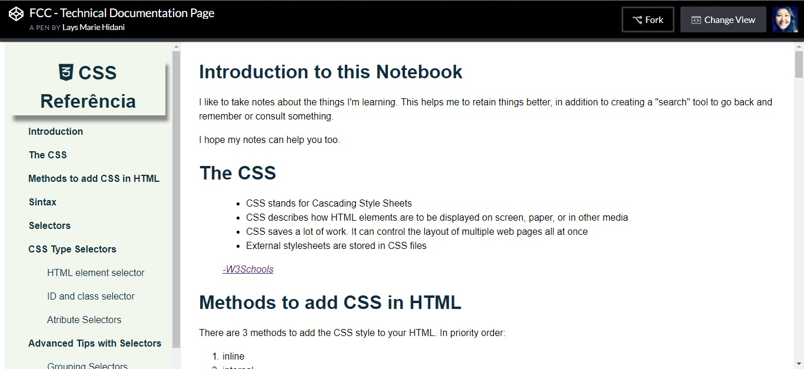

---
### :calendar: R1D14
**Today's Progress:**  Review box model, float, horizontal and vertical navs.

---
### :calendar: R1D15
**Today's Progress:**  Working on FCC Technical Documentation Page.

**thoughts**

**Link to work:** [FCC - Technical Documentation Page](https://codepen.io/hlays/full/qQQePp)

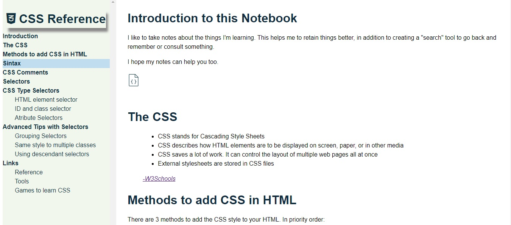

---
### :calendar: R1D16
**Today's Progress:**  I have completed the FCC Technical Documentation page.

**thoughts** In this project I've struggled a little harder to pass the FCC test. It's because there was a typo in a href link in navbar and it took me a long time to find it. I broke my head, but after resolving it, it all seemed like a silly fail. I will add more content to this page in the future.

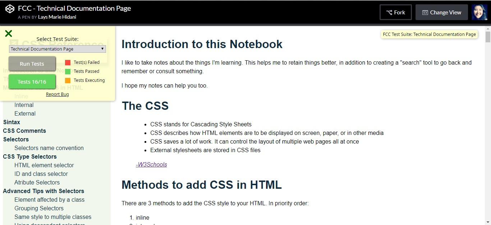

**Link to work:** [FCC - Technical Documentation Page](https://codepen.io/hlays/full/qQQePp)

---
### :calendar: R1D17
**Today's Progress:**  I'm working on the FCC landing page.

**thoughts** I'm having difficulty because my navbar (using display flexbox) is not working well with "fixed position".

**Link to work:** [FCC - Landing Page](https://codepen.io/hlays/full/LXKGYq)

---
### :calendar: R1D18
**Today's Progress:**  I'm working in #freeCodeCamp Landing page project.

**thoughts** Fixed my navbar. Now, I have to fix some test issues.

**Link to work:** [FCC - Landing Page](https://codepen.io/hlays/full/LXKGYq)

---
### :calendar: R1D19
**Today's Progress:**  
- Javascript tutorials and exercises. 
- CSS Dinner
- CSS grid Garden 

---
### :calendar: R1D20
**Today's Progress:**  
- Javascript tutorials and exercises. 
- CSS Dinner
- CSS grid Garden 

---
### :calendar: R1D21
**Today's Progress:**   JS functions

**thoughts** to know a little of python help me a lot to learn javascript

---
### :calendar: R1D22
**Today's Progress:**   Reviewing HTML, CSS and JS.

---
### :calendar: R1D23
**Today's Progress:**   Working on a Trivia project with HTML, CSS and JavaScript.

---
### :calendar: R1D24
**Today's Progress:**   Trivia Project - Laboratoria (pre admission) concluded.

**thoughts** It was difficult to finish this project on time, but the task was completed successfully!

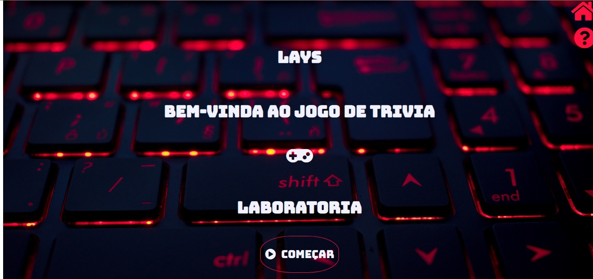

---
### :calendar: R1D25 #100DaysOfCode

**Today's Progress:**  Code review with my Laboratoria squad, quiz, JavaScript list of exercises.

**thoughts** I enjoyed doing this code review, it's amazing how each person finds a different solution to the same problem. It's cool.

---
### :calendar: R1D26

**Today's Progress:**  More JS and exercises.

---
### :calendar: R1D27 
(I paused for this weekend because of appointments. But I read articles and I listened to podcasts in free time.)

**Today's Progress:**  Working on the tests of FCC Product Landing Page and watching JS tutorials.

---
### :calendar: R1D28 #100DaysOfCode
**Today's Progress:**  I'm working on the FCC landing page. I decided to start with another one. 

I reviewed the fundamentals of JS.

**thoughts** I've to make a navigation menu fixed at the top. As much as I like this set menu on the left side of the page ...

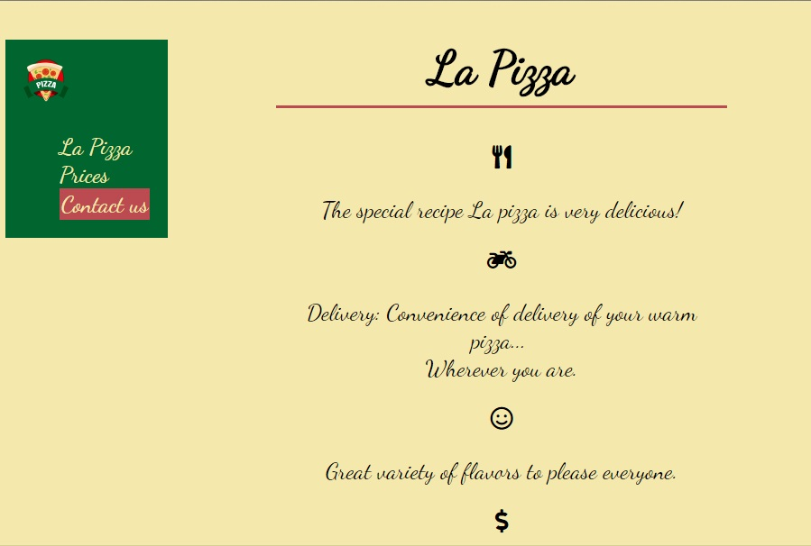

**Link to work:** [FCC - Landing Page](https://codepen.io/hlays/full/LXKGYq)

---
### :calendar: R1D29 #100DaysOfCode
**Today's Progress:**  

- I made the horizontal navigation bar fixed in the FCC Product Landing Page project.
- Work on JS FreeCodingCamp lessons and watch tutorials on JS arrays.

**thoughts** I have only one problem to solve in this project to pass the FCC test. The page was very simple, but I liked the result.

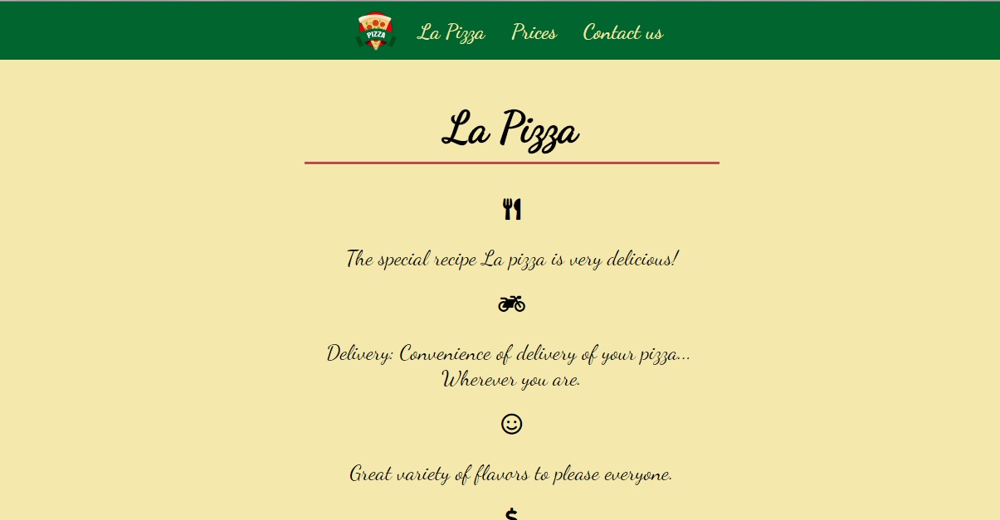

**Link to work:** [FCC - Landing Page](https://codepen.io/hlays/full/LXKGYq)

---
### :calendar: R1D30 #100DaysOfCode
**Today's Progress:**  

- FCC Product Landing Page Complete! I am now working on FCC Personal Portifolio (which will have more projects :) thanks @freecodecamp for this content building curriculum and experience gained during the projects).
- I worked on the FCC JS curriculum exercises today. I also did some other JS exercises on arrays and functions and watched JS tutorials.

**thoughts** Day 30! A Challenge Month #100DaysOfCode.

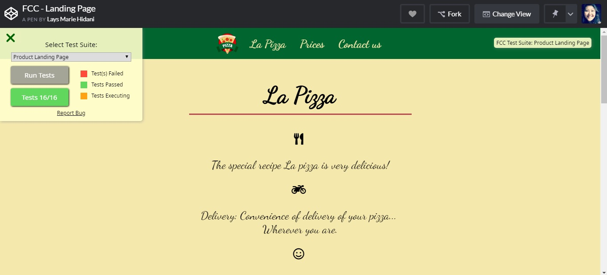

**Link to work:** [FCC - Landing Page](https://codepen.io/hlays/full/LXKGYq)

---
### :calendar: R1D31 #100DaysOfCode
**Today's Progress:**  

- I started working at FCC Personal Portifolio,
- JS exercises on switch and functions,
- FCC Javascript exercises.

**thoughts** 

---
### :calendar: R1D32 #100DaysOfCode
**Today's Progress:**  

- JS exercises and Tutorials,
- FCC Javascript exercises.

**thoughts** 

---
### :calendar: R1D33 #100DaysOfCode
**Today's Progress:**  

- JS arrays,
- JS wrapper objects,
- @freecodecamp Javascript exercises.

**thoughts**  It's fun work with arrays.

---
### :calendar: R1D34 #100DaysOfCode
**Today's Progress:**  

- Working on FCC Personal Portifolio (There is still much to improve, but it is going!)
- Watched JS Tutorials

**thoughts**  Today is Christmas Eve, but code challenge is completed!

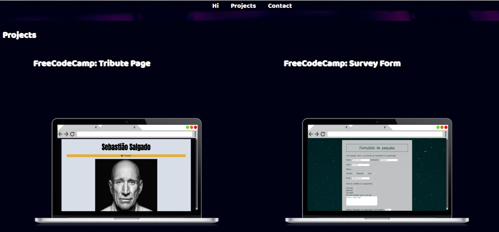

**Link to work:** [FCC - Personal Portifolio](https://repl.it/@hlays/FCC-Personal-Portifolio)

---
### :calendar: R1D35 #100DaysOfCode
**Today's Progress:**  

- JS: do, for, for in
- Git Merge and rebase articles and tutorials

---
### :calendar: R1D36 #100DaysOfCode
**Today's Progress:**  

- FCC Personal Portifolio complete.
- Watched JS Tutorials (objects)

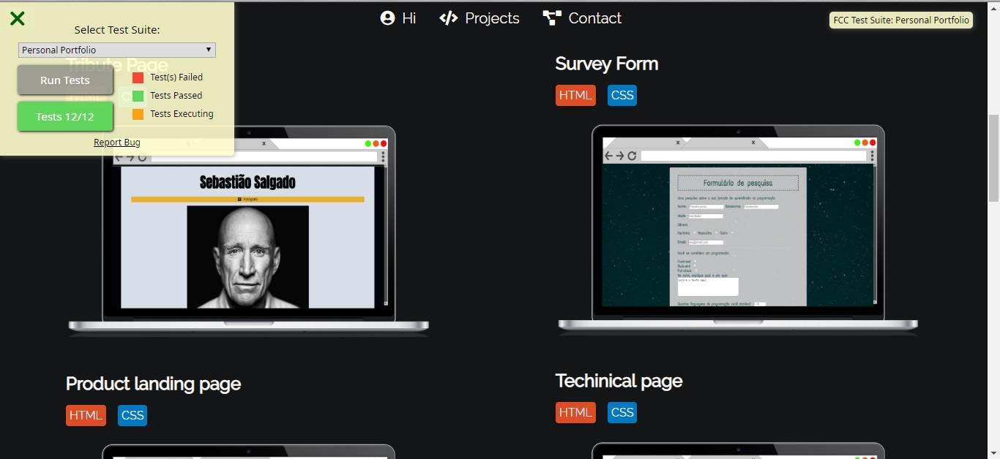

**Link to work:** [FCC - Personal Portifolio](https://repl.it/@hlays/FCC-Personal-Portifolio)

---
### :calendar: R1D37 #100DaysOfCode
**Today's Progress:**  

- @freecodecamp Responsive Web Design complete!
- JS Exercises (converting type, functions)
- Pluralsight How Git Works complete
- Pluralsight HTML, CSS, JS: Big Picture complete

**thoughts** 
Today the day is being productive.

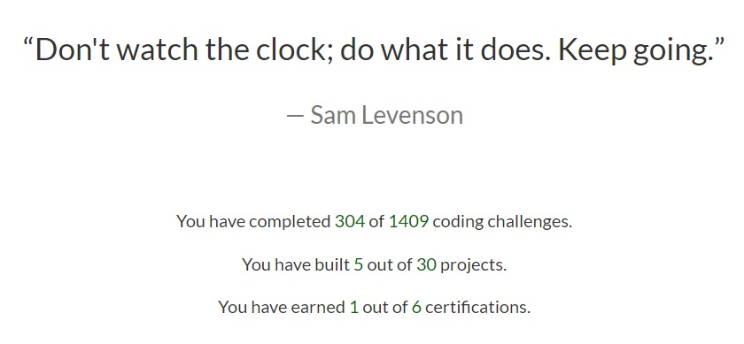

---
### :calendar: R1D38 #100DaysOfCode
**Today's Progress:**  
- JS tutorials (objects)
- Pluralsight Mastering Git

---
### :calendar: R1D39 #100DaysOfCode
**Today's Progress:**  
- Today, I have made some improvements in FCC Personal Portifolio, but I still want to improve it more.
- JS Tutorials and Exercises (Array Methods)

***thoughts**
As I improve my knowledge and experience, I want to get back on the FCC projects and improve them.

---
### :calendar: R1D40 #100DaysOfCode
**Today's Progress:** 
- Pluralsight Mastering Git complete
- Starting Pluralsight Building a JavaScript development environment (and loving this course)
- JS tutorials on array methods

**thoughts**

---
### :calendar: R1D41 #100DaysOfCode
**Today's Progress:**  
- JS Tutorials (this, browser, more about Array Methods)

**thoughts**

Today is the Last day of the year 2018...
2019 is coming and I wish a year full of good achievements for all of us!

---
### :calendar: R1D42 #100DaysOfCode 
- Advancing on course: Building a development environment (Pluralsight)
- Reading some articles. 

**Link to work:** [A good article I've read: Pro tips for Visual Studio Code to be productive in 2018](https://dev.to/teamxenox/pro-tips-for-visual-studio-code-to-be-productive-in-2018--1jek)

---
### :calendar: R1D43 #100DaysOfCode 
- Advancing on course: Building a development environment (Pluralsight)
- JS Tutorials and exercises

**Link to work:** [The Chronicles of JavaScript Objects](https://blog.bitsrc.io/the-chronicles-of-javascript-objects-2d6b9205cd66)

---
### :calendar: R1D44 #100DaysOfCode 
- JS Exercises
- tutorials
- articles

**Recommended article:** [Time-saving CSS techniques to create responsive images](https://medium.freecodecamp.org/time-saving-css-techniques-to-create-responsive-images-ebb1e84f90d5)

---
### :calendar: R1D45 #100DaysOfCode 
- JS Challenges on HackerRank (I won my first bronze badge)
- JS tutorials
- articles

**Link:** [My Hacker Rank profile](https://www.hackerrank.com/hlays)

---
### :calendar: R1D46 #100DaysOfCode
- JS Challenges on HackerRank (I won my second star on the 10 Days of JS Badge on HackerRank)
- JS Tutorials and Exercises
- Advancing the @freecodecamp JS curriculum

**Thoughts:** Working hard on JavaScript in the last few days.

**Link:** [My Hacker Rank Profile](https://www.hackerrank.com/hlays)

---
### :calendar: R1D47 #100DaysOfCode
- JS Challenges on HackerRank #10daysofjavascript (day 3)
- JS Tutorials
- articles

**Thoughts:** Practice, practice, practice!
I need to improve my problem solving and use/domain of JS. It's like learning to speak a new language, sometimes you know what you mean, but do not know how to express yourself .. or sometimes you do not know anything at all ...

**Link:** [Recommended article: How to read is your way to becoming a better developer](https://getpocket.com/a/read/2116159513)

---
### :calendar: R1D48 #100DaysOfCode
- JS Challenges on HackerRank #10daysofjavascript
- Reviewing JS objects, constructors
- articles

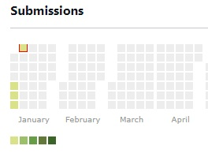

**Link:** [My Hacker Rank Profile](https://www.hackerrank.com/hlays)

---
### :calendar: R1D49 #100DaysOfCode
- JS Challenges on HackerRank #10daysofjavascript
- Today I worked on a very simple Web Project to train JS: A temperature converter. And as simple as it sounds, it did a bit of work. Mainly to understand how to handle the DOM. 
- I learned to store the value of an HTML input in a variable for use in JS.
- and I learned how to make the results appear simultaneously for the other two temperatures when I enter the temperature value to be converted (now it seems simple, but it took me a while to figure it out).

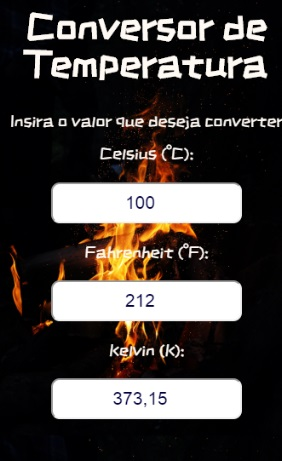

**Link:** [Conversor de Temperatura](https://Conversor-de-Temperatura--hlays.repl.co)

---
### :calendar: R1D50 #100DaysOfCode
- JS Challenges on HackerRank #10daysofjavascript
- JS tutorials
- @freeCodeCamp JS (regular expressions)

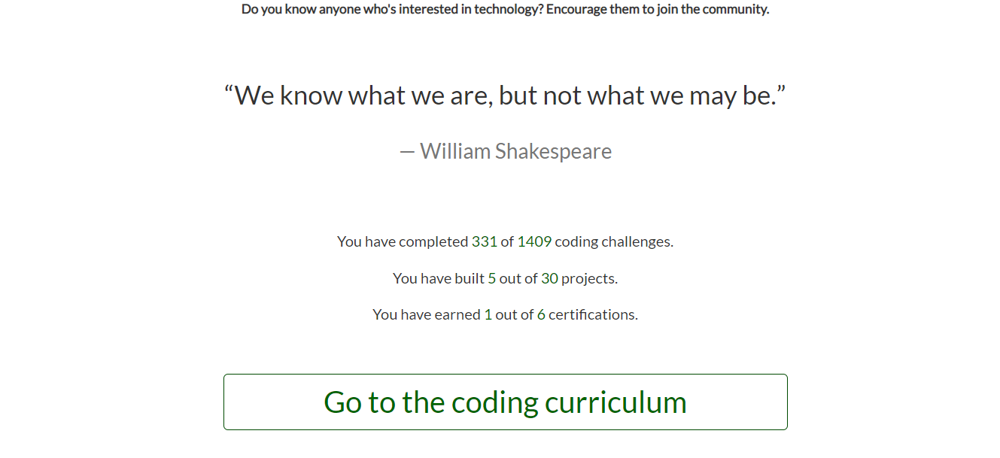

**Link:** [FreeCodeCamp Profile](https://www.freecodecamp.org/hlays)

---
### :calendar: R1D51 #100DaysOfCode
(I am very grateful to Microsoft Dev Collective for the free 90 days for the 30 courses selected from Pluralsight. If interested, see the link below.)
- I completed my code day today, advancing in the pluralsight course and reading some articles throughout the day.

**thoughts:** Today I had appointments to attend and I did not have much time to program, I was able to fulfill my 1 hour of code, but I did not have time to solve any challenge of #10daysOfJavascript

**Link:** [Microsoft Dev Collective](https://help.pluralsight.com/help/microsoft-dev-collective)

---
### :calendar: R1D52 #100DaysOfCode
- JS tutorials: RegEx (love it!)
- Reviewing general JS and taking notes

**thoughts:** I'll pause the challenge 10 days of JS in Hacker Rank until I get enough knowledge to finish it...

[Super secret VS Code hacks to boost your productivity](https://medium.freecodecamp.org/here-are-some-super-secret-vs-code-hacks-to-boost-your-productivity-20d30197ac76)

---
### :calendar: R1D53 #100DaysOfCode
- Javascript 30 - Drum Project Complete
- Today I'm also organizing some files, updating read.me files and links from my projects.

**thoughts:** I will start a bootcamp next week, so I probably will not have as much time each day to complete my challenges in Hacker Rank (which I intend to do gradually, when I have the necessary knowledge to complete them), FreeCodeCamp and # javascript30 Wes Bos. That way, whenever I have a free time, I will continue with these projects which are great and I will remain engaged in completing them.

[My Project: JS30 - Drum](https://js30-drum--hlays.repl.co/)

---
### :calendar: R1D54 #100DaysOfCode
- Semantic HTML (done ✔️)
- JS30 Clock (in progress)

[Semantic HTML (Pluralsight)](https://app.pluralsight.com/library/courses/semantic-html-2329/table-of-contents)

---
### :calendar: R1D55 #100DaysOfCode
- JS tutorials
- Articles

[When to use IMG vs. CSS background-image?](https://stackoverflow.com/questions/492809/when-to-use-img-vs-css-background-image/1469139#1469139)

---
### :calendar: R1D56 #100DaysOfCode
- JS Tutorials
- Exercises on Regex on @freeCodeCamp
- Review of some notes in my JS Notebook

**thoughts:** Tomorrow I will start Laboratoria bootcamp...I'm anxious!

[FreeCodeCamp](https://www.freecodecamp.org/hlays)

---
### :calendar: R1D57 #100DaysOfCode
- HTML, CSS, JS 
- coding review 

**thoughts:** I hope one day to learn enough CSS to make my pages look better !

---
### :calendar: R1D58 #100DaysOfCode
- Review of Logic and Flowcharts (bootcamp)
- JS Tutorials

[Pluralsight JS Fundamentals](https://app.pluralsight.com/library/courses/javascript-fundamentals)

---
### :calendar: R1D59 #100DaysOfCode
- Logic
- JS exercises
- Shell
- Git, Github

---

### :calendar: R1D60 #100DaysOfCode
- JS30 clock
- JS Tutorials (DOM)

[JS30 clock](https://js30-clock--hlays.repl.co/)

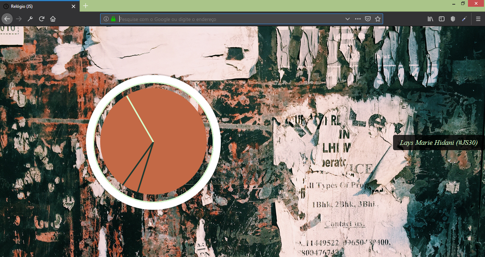

---

### :calendar: R1D61 #100DaysOfCode
- I finished the @FreeCodeCamp JS Regex session
- JS Exercises (string methods)
- Responsive Design tutorials

[FreeCodeCamp](https://www.freecodecamp.org/hlays)

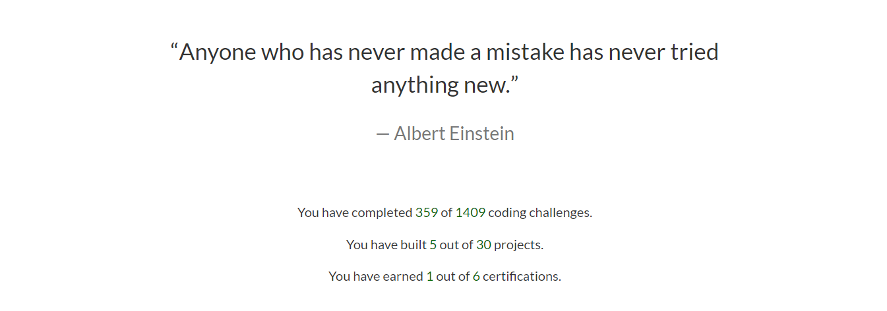

---

### :calendar: R1D62 #100DaysOfCode
- Responsive design tutorials (images, menu)
- Project Cypher (start)
-#javascript30 Playing with variables (start)

[JS30 - Wes Bos](https://javascript30.com/)

---

### :calendar: R1D63 #100DaysOfCode 
- Responsive design tutorials (images, ux)
- Project Cypher

**thoughts:** Cypher is a bootcamp project, I'm learning to plan more before I start coding .. think of ux, flowchart, organize steps, etc ... 
Learning more about tools like Trello, kanban, slack.

---

### :calendar: R1D64 #100DaysOfCode 
- JS tutorials (Regex)
- Bootcamp: 
    - Review -> Array, string methods, functions
    - Working in Project Cipher (HTML, CSS)

[Project Cipher](https://lesslabgreater-cipher--hlays.repl.co/#cipher)
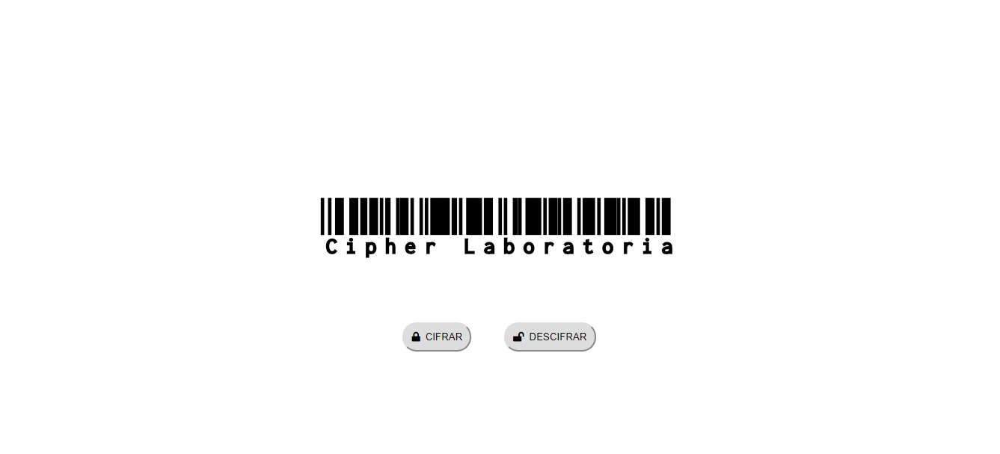

---

### :calendar: R1D65 #100DaysOfCode 
- Scrum tutorials
- Bootcamp: 
    - Js exercises -> Array, string methods, functions
    - Working in Project Cipher (JS)

[Project Cipher](https://lesslabgreater-cipher--hlays.repl.co/#cipher)

---

### :calendar: R1D66 #100DaysOfCode 
- Bootcamp: 
    - Today: struggling to develop javascript from project cipher (laboratoria) 😁

[Project Cipher](https://lesslabgreater-cipher--hlays.repl.co/#cipher)

---

### :calendar: R1D67 #100DaysOfCode 
- Bootcamp Project: 
    - Working in Project Cipher (JS. Function encode() is done. Now I have to solve how to decode() with offsets >= 26, and solve problem with the DOM because it is not picking up the input text).

[Project Cipher](https://hlays.github.io/caesar-cipher/src/index.html)
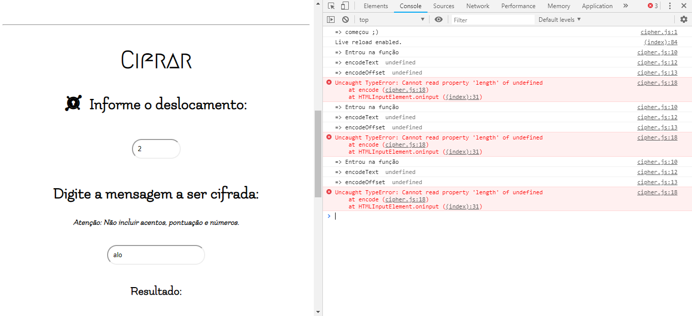

---

### :calendar: R1D68 #100DaysOfCode 
- Bootcamp Project: 
    - Today, still struggling to develop Cipher.
Tomorrow is the partial delivery of my cipher project. I've been able to fix some things, but it's still incomplete.
I hope that by the end of next week it will be finalized and working properly.

[Project Cipher](https://hlays.github.io/caesar-cipher/src/index.html)
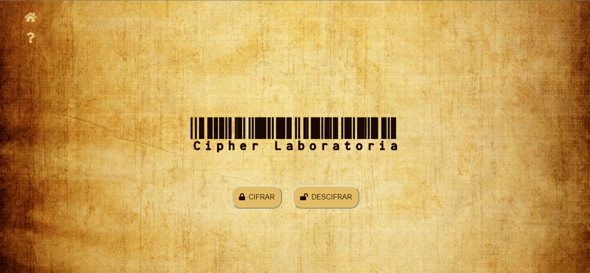

---

### :calendar: R1D69 #100DaysOfCode 
- Laboratoria: 
  - coding review
  - planning 
  - project cipher

[Project Cipher](https://hlays.github.io/caesar-cipher/src/index.html)

---

### :calendar: R1D70 #100DaysOfCode 
- Laboratoria: 
    - Tests in JS
    - Project Cipher: I did some testing for the project and fixed some problems in JS.

[Project Cipher](https://hlays.github.io/caesar-cipher/src/index.html)

*img from "Limão e Sal", Laura Maria Marques Paulo*

---

### :calendar: R1D71 #100DaysOfCode 
- Laboratoria: 
    - JS Objects
    - Project Cipher <Sprint 2> (solved problem with the DOM. Now I'm trying to solve negative offset and problem with decode function)

[Project Cipher](https://hlays.github.io/caesar-cipher/src/index.html)

---

### :calendar: R1D72 #100DaysOfCode 
- Laboratoria: 
    - Guided exercises (JS Objects)
    - Project Cipher (Complete)

[Project Cipher](https://hlays.github.io/caesar-cipher/src/index.html)

Here's a super article for new developers to help us fight and manage with all this pressure to start learning something totally new.
[Here’s what you need to know as a new developer](https://medium.freecodecamp.org/survival-guide-for-new-developers-12d9b048bf06)

---

### :calendar: R1D73 #100DaysOfCode 
- Laboratoria: 
    - BlueDay (remote studying)
    - Project Cipher (improving responsive design)
    - Exercises arrays JS
- JS30 - Playing with CSS Variables and JS

[Project Cipher](https://hlays.github.io/caesar-cipher/src/index.html)

[15 Useful JS Examples of map(), reduce() and filter()](https://medium.com/@alex.permyakov/15-useful-javascript-examples-of-map-reduce-and-filter-74cbbb5e0a1f)

---

### :calendar: R1D74 #100DaysOfCode 
- more JS exercises (arrays)
- improvement of responsive design of project cipher (background, font size, menu)

*thoughts* this is one of the things that I most enjoy and admire in the area of ​​technology, as communities are more open to sharing knowledge.

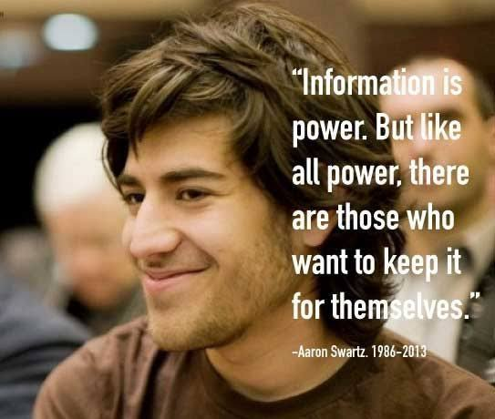

---

### :calendar: R1D75 #100DaysOfCode 
- JS30 - Playing with CSS Variables and JS (complete)
- JS Exercises (objects)

*thoughts* this is one of the things that I most enjoy and admire in the area of ​​technology, as communities are more open to sharing knowledge.

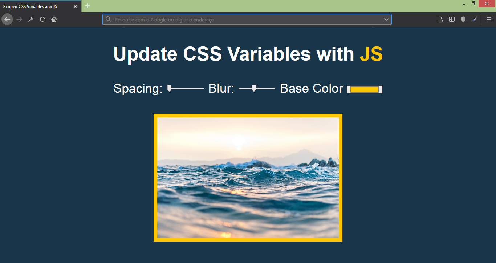

---

### :calendar: R1D76 #100DaysOfCode 
- Laboratoria:
    - Cipher Project (demo, retrospective)
- Pluralsight VSCode

*thoughts* I learned a lot from this project. In addition to technical knowledge, much about socio-emotional skills, organization, planning, scrum ...

[ASSUMINDO O PAPEL DE PROTAGONISTA EM NOSSA APRENDIZAGEM](https://woliveiras.com.br/posts/assumindo-o-papel-de-protagonista-em-nossa-aprendizagem/)

---

### :calendar: R1D77 #100DaysOfCode 
- Pluralsight VScode
- working in a Memory Game (js):

[“Memory Game in Vanilla JavaScript” by Marina Ferreira](https://medium.freecodecamp.org/vanilla-javascript-tutorial-build-a-memory-game-in-30-minutes-e542c4447eae)

---

### :calendar: R1D78 #100DaysOfCode 
- Laboratoria:
    - LMS: finish JS exercises (Arrays, objects)
- Pluralsight VSCode
- @FreeCodeCamp JS Debugging complete

"Wheter you want to uncover the secrets of the universe, or you want to pursue a carrer in the 21st century, basic computer programming is an essential skill to learn." -Stephen Hawking

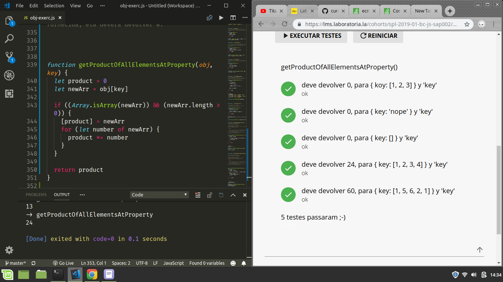
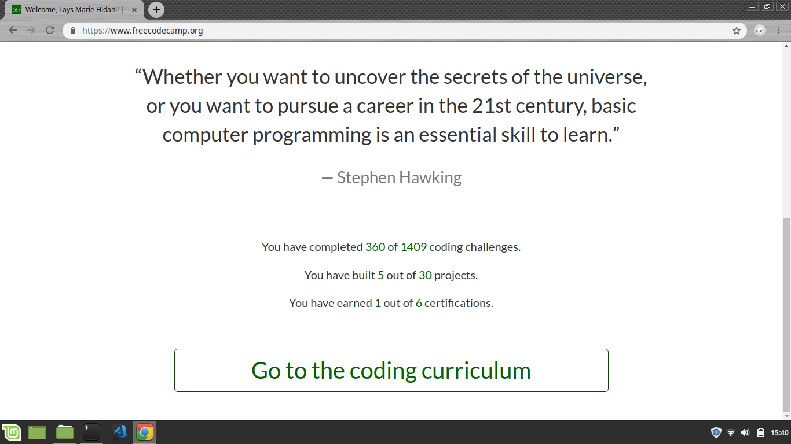

---

### :calendar: R1D79 #100DaysOfCode 

- Pluralsight VSCode
- JS Browser

[4 Dicas úteis de strings para JavaScript
](https://medium.com/@crp_underground/4-dicas-%C3%BAteis-de-strings-para-javascript-78cd20954cf2)

---

### :calendar: R1D80 #100DaysOfCode 
- Laboratoria:
    - cipher project retrospective
    - ux
    - ux exercise

- Pluralsight VSCode

---

### :calendar: R1D81 #100DaysOfCode 
-  #freeCodeCamp 
    - Basic Data Structures (done)
    - Basic Algorithm Scripting (doing)
- #JavaScript30 Array Cardio Day 1 (doing)

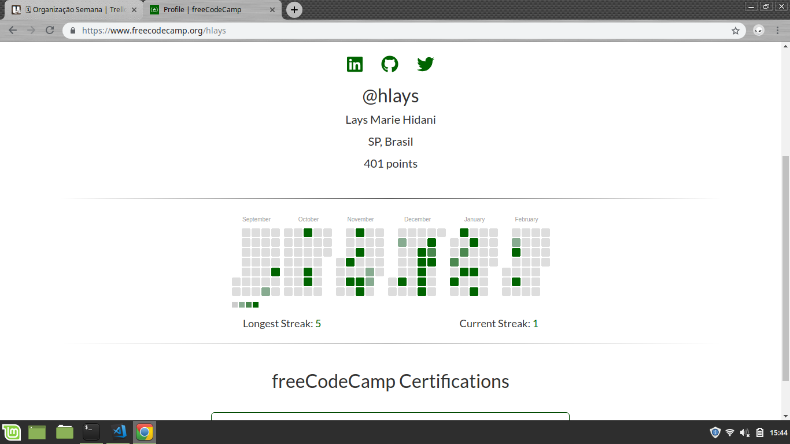

---

### :calendar: R1D82 #100DaysOfCode 
- #freeCodeCamp 
    - Basic Algorithm Scripting (done)
- #JavaScript30 Array Cardio Day 1 (done)
- command line (practicing)

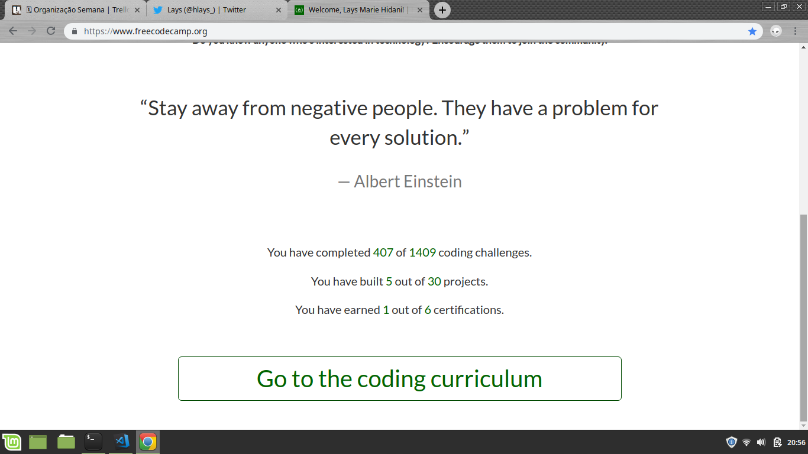

---

### :calendar: R1D83 #100DaysOfCode 
- Pluralsight VSCode
- Lab: ux e design Sprint

**Link recommendation:**[Let’s explore Slice(), Splice() & Spread Syntax(…) in JavaScript](https://medium.freecodecamp.org/lets-explore-slice-splice-spread-syntax-in-javascript-e242a6f21e60)

---

### :calendar: R1D84 #100DaysOfCode 
- Pluralsight VSCode
- Laboratoria: design Sprint
  theory and practice

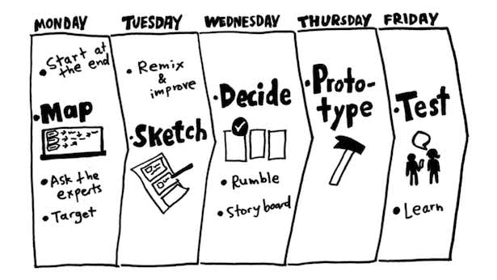
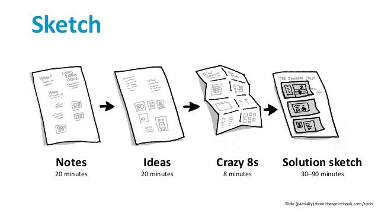

---

### :calendar: R1D85 #100DaysOfCode 
- Pluralsight VSCode
- Laboratoria: I started the 'Freelancer' project, where we will have to replicate a site, mainly to train CSS.

**Link recommendation:** [When (and why) you should use ES6 arrow functions — and when you shouldn’t](https://medium.freecodecamp.org/when-and-why-you-should-use-es6-arrow-functions-and-when-you-shouldnt-3d851d7f0b26)

---

### :calendar: R1D86 #100DaysOfCode 
- Pluralsight VSCode
- Laboratoria: project 'Freelancer' complete.

[Freelancer](https://hlays.github.io/freelancer/)
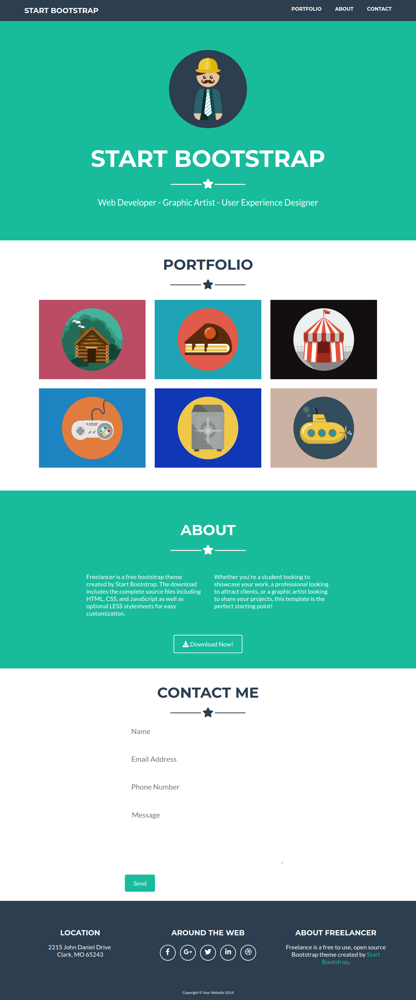

---

### :calendar: R1D87 #100DaysOfCode 
- @freeCodeCamp: Object Oriented Programming (doing)
- Laboratoria: Project "Lyft Clone" (ok)

**Thoughts:** All of Laboratoria's projects seem impossible at first and far beyond my knowledge and capabilities. It's 50% of the time very difficult and it seems that really has no solution, so 20% of the time, thinking, "I do not know how, but I have to do it...", then 20% of the time: "I can do it!", Finally , 10% of the time: "I'm doing it, I'm really doing it!".

---

### :calendar: R1D88 #100DaysOfCode 
- #JavaScript30 Flex Panel Gallery (ok)
- #freeCodeCamp: Object Oriented Programming (doing)
- Project: Etanol ou Gasolina? (fixed error JS)

[JS30 - Flex Pannel](https://hlays.github.io/learning-web/js30-flex-panels-gallery/)
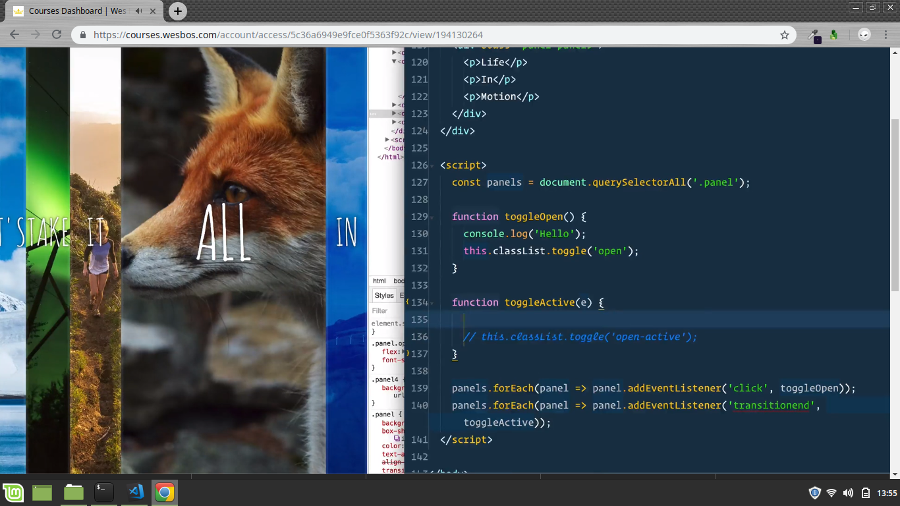

[Etanol ou Gasolina?](https://hlays.github.io/learning-web/Projeto-Etanol-ou-Gasolina/)
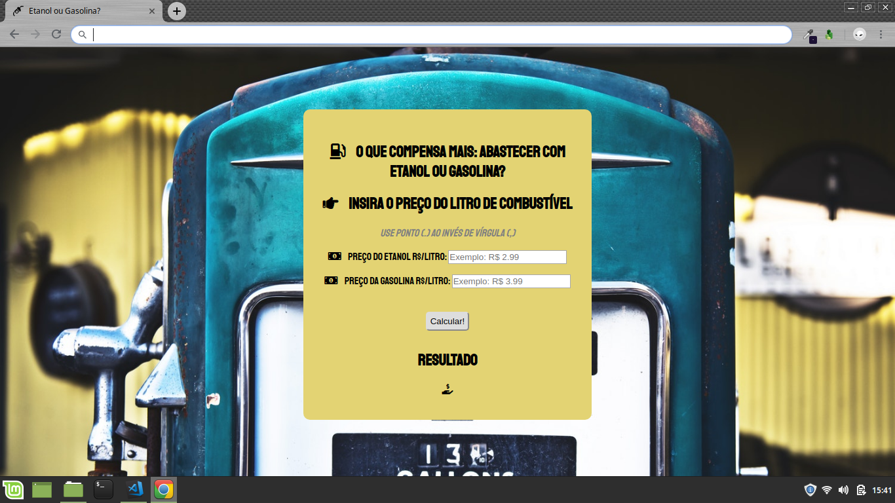

---
### :calendar: R1D89 #100DaysOfCode 
- #freeCodeCamp: Object Oriented Programming (ok)
- Udemy - CSS: um passo adiante (CSSOO, SMACSS) - doing

[Udemy - CSS: um passo adiante](https://www.udemy.com/css-um-passo-adiante/)

---

### :calendar: R1D90 #100DaysOfCode 
- #freeCodeCamp: Functional Programming (doing)
- Udemy - CSS: um passo adiante (SMACSS) (doing)
- Laboratoria: Kick off Twitter (new Project sprint 2) 

[Udemy - CSS: um passo adiante](https://www.udemy.com/css-um-passo-adiante/)

[Project Twitter](https://www.udemy.com/css-um-passo-adiante/)
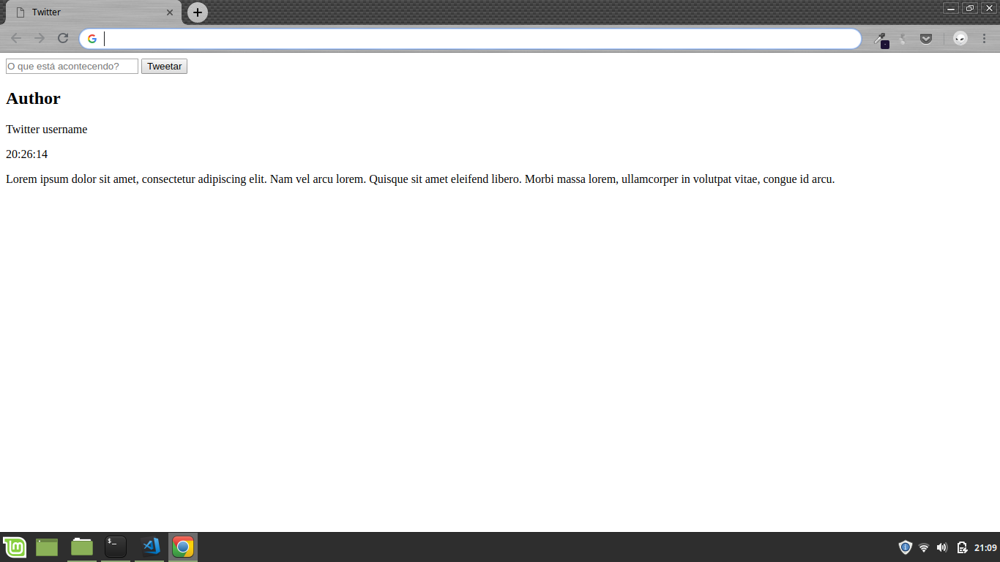

**Recommended reading:**

[How to Feel Less Overwhelmed as a Developer](https://medium.com/@juliahaigh/how-to-feel-less-overwhelmed-as-a-developer-79bc816709de/)

---

### :calendar: R1D91 #100DaysOfCode 
Laboratoria: 
   - Studying more about DOM, javascript
   - Working on a simplified Twitter news feed project

---

### :calendar: R1D92 #100DaysOfCode 
Laboratoria: 
   - My simplified Twitter news feed project is finally ready! I'm really happy about it ... it's been 3 days of hard work.

JS:
  - Regex exercises

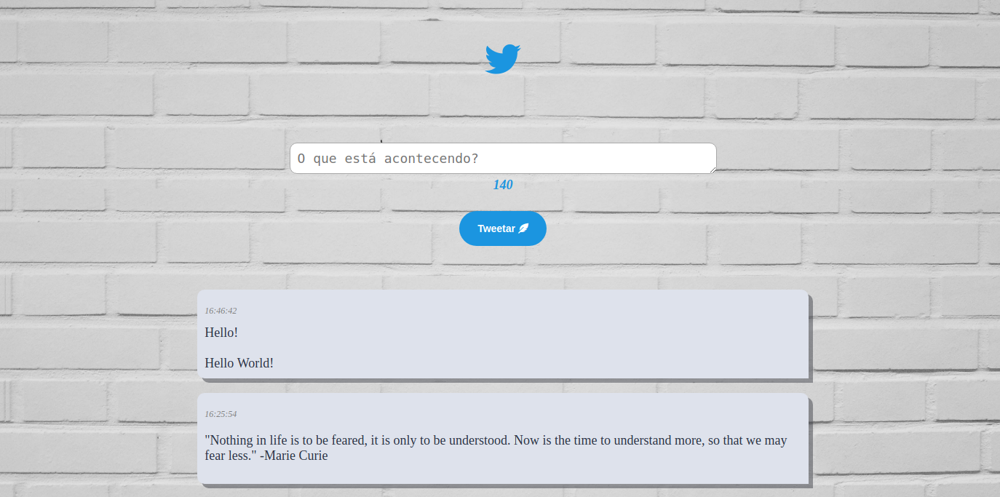

---

### :calendar: R1D93 #100DaysOfCode 
Laboratoria: 
   - Demo (Project Twitter)

JS:
  - #freecodecamp Functional Programming (doing)

I recommend this great article again:
[The Chronicles of JavaScript Objects](https://blog.bitsrc.io/the-chronicles-of-javascript-objects-2d6b9205cd66)

---

### :calendar: R1D94 #100DaysOfCode 

- laboratoria:
  - review js methods 
  - kickoff project "Data Lovers"

---

### :calendar: R1D95 #100DaysOfCode 

- Design Sprint: project "Data Lovers"
- CSS: Flexbox (tutorials and exercises)

*PS: I forgot to post yesterday*

Amazing tool:
[FlexBox Playground](https://demos.scotch.io/visual-guide-to-css3-flexbox-flexbox-playground/demos/)

---

### :calendar: R1D96 #100DaysOfCode 

- Design Sprint: project "Data Lovers"
- CSS: GRID (tutorials)
- CSS BEM: (udemy)

Amazing tool:
[Learn CSS GRID](https://learncssgrid.com/)

Udemy:
[CSS: um passo adiante](https://www.udemy.com/css-um-passo-adiante/)

---

### :calendar: R1D97 #100DaysOfCode 

- Laboratoria: working on project "Data Lovers"

Recommended:
[JS: Master the DOM](https://medium.com/re-dom/master-the-dom-bc1a2a06089b)

*(Thank you to the author of this article. I finally learned how to use: creatElement, setAttribute, textContent, etc.)*

---

### :calendar: R1D98 #100DaysOfCode 

- I continue to work on the Laboratoria Sprint 2 project, facing some difficulties working with filter() and map() to manipulate the (monstrous) data of the project.

- Local Storage (class)

---

### :calendar: R1D99 #100DaysOfCode 

-Laboratoria: I made some progress in the Data Lovers project. I was able to fix some functions!

Recommended:
[JavaScript: Conhecendo map(), filter() e reduce()](https://medium.com/@programadriano/javascript-conhecendo-map-filter-e-reduce-ce072d8f0ec5)

---
### :calendar: R1D100 #100DaysOfCode 

Day 100!
I am so happy to complete this challenge and for all the experiences, commitment and things I have learned through it.

Thanks all who have been with me and supported me! I hope to repeat it soon.

Learning never ends, and that's what's fun about it! 

...I'm still here breaking my head to manipulate the data in my project that has arrays with hundreds of objects, which in turn have several other arrays and objects and so on ...

---

Thank you!

